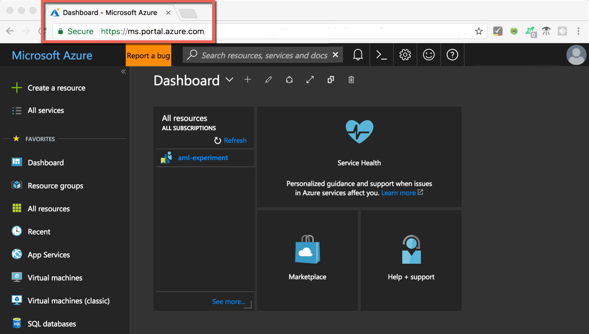
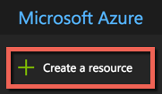
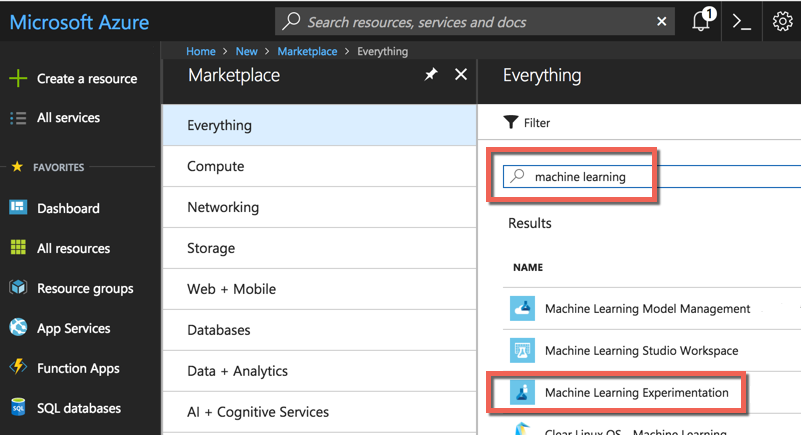
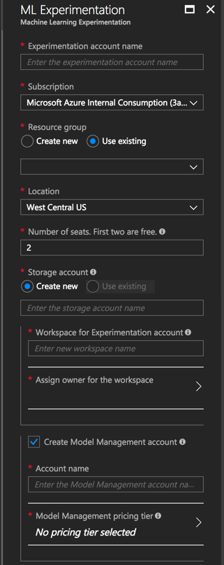
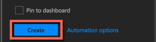
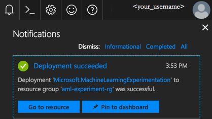

## Create a Machine Learning Experimentation Account
Use the Azure portal to provision your Machine Learning Experimentation account.: 
1. Sign in to the [Azure portal](https://portal.azure.com/) using the credentials for the Azure subscription you'll use. If you don't have an Azure subscription, create a [free account](https://azure.microsoft.com/free/?WT.mc_id=A261C142F) now. 

   

1. Select the **Create a resource** button (+) in the upper-left corner of the portal.

   

1. Enter **Machine Learning** in the search bar. Select the search result named **Machine Learning Experimentation**. 

   

1. In the **Machine Learning Experimentation** pane, scroll to the bottom and select **Create** to begin defining your experimentation account.  

   

1. In the **ML Experimentation** pane, configure your Machine Learning Experimentation account. 

   Setting|Suggested value for tutorial|Description
   ---|---|---
   Experimentation account name | _Unique name_ |Enter a unique name that identifies your account. You can use your own name, or a departmental or project name that best identifies the experiment. The name should be 2 to 32 characters. It should include only alphanumeric characters and the dash (-) character. 
   Subscription | _Your subscription_ |Choose the Azure subscription that you want to use for your experiment. If you have multiple subscriptions, choose the appropriate subscription in which the resource is billed.
   Resource group | _Your resource group_ | Use an existing resource group in your subscription, or enter a name to create a new resource group for this experimentation account. 
   Location | _The region closest to your users_ | Choose the location closest to your users and the data resources.
   Number of seats | 2 | Enter the number of seats. Learn how [seating impacts pricing](https://azure.microsoft.com/pricing/details/machine-learning/).  For this Quickstart, you only need two seats. Seats can be added or removed as needed in the Azure portal.
   Storage account | _Unique name_ | Select **Create new** and provide a name to create an [Azure storage account](https://docs.microsoft.com/azure/storage/common/storage-quickstart-create-account?tabs=portal). The name should be 3 to 24 characters, and should include only alphanumeric characters. Alternatively, select **Use existing** and select your existing storage account from the drop-down list. The storage account is required and is used to hold project artifacts and run history data. 
   Workspace for Experimentation account | IrisGarden (name used in tutorials) | Provide a name for a workspace for this account. The name should be 2 to 32 characters. It should include only alphanumeric characters and the dash (-) character. This workspace contains the tools you need to create, manage, and publish experiments.
   Assign owner for the workspace | _Your account_ | Select your own account as the workspace owner.
   Create Model Management account | **check** |Create a Model Management account now so that this resource is available when you want to deploy and manage your models as real-time web services.   While optional, we recommend creating the Model Management account at the same time as the Experimentation account.
   Account name | _Unique name_ | Choose a unique name that identifies your Model Management account. You can use your own name, or a departmental or project name that best identifies the experiment. The name should be 2 to 32 characters. It should include only alphanumeric characters and the dash (-) character. 
   Model Management pricing tier | **DEVTEST** | Select **No pricing tier selected** to specify the pricing tier for your new Model Management account. For cost savings, select the **DEVTEST** pricing tier if it's available on your subscription (limited availability). Otherwise, select the S1 pricing tier. Click **Select** to save the pricing tier selection. 
   Pin to dashboard | _check_ | Select the **Pin to dashboard** option to allow easy tracking of your Machine Learning Experimentation account on the front dashboard page of the Azure portal.

   

5. Select **Create** to begin the creation process of the Experimentation account along with the Model Management account.

   

   It can take a few moments to create an account. You can check on the status of the deployment process by clicking the Notifications icon (bell) on the Azure portal toolbar.
   
   
