# Creating Windows 10 VM in Azure    

## 1. Login to Azure Portal    
Go to https://portal.azure.com    
Use your Azure Account to login.    

## 2. Search for Windows 10 VM    
In the Azure Portal Search Box, search for "windows 10".

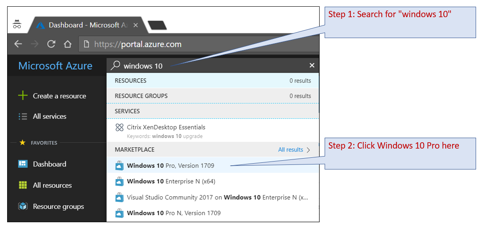

## 3. Configure VM 
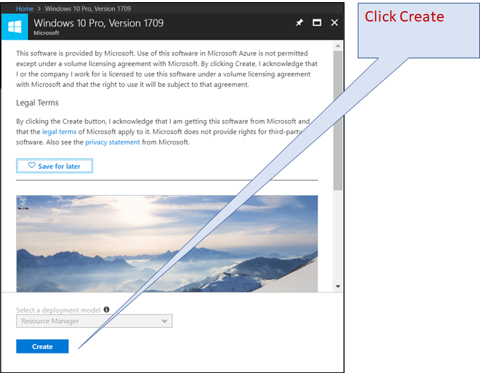

## 4. Configure Basic Settings and Click OK
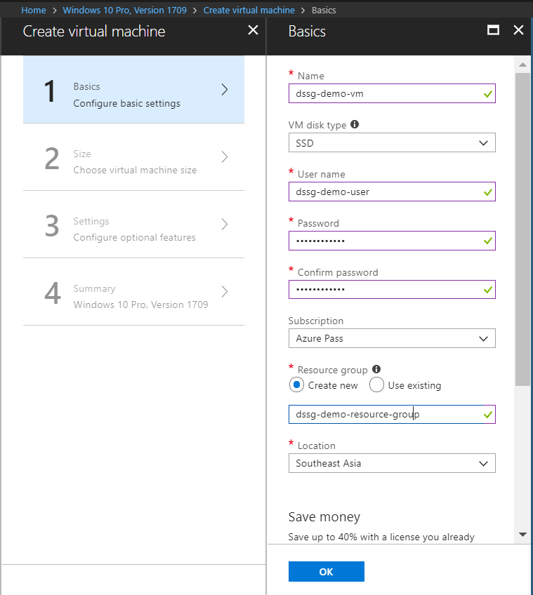

## 5. Select VM Size
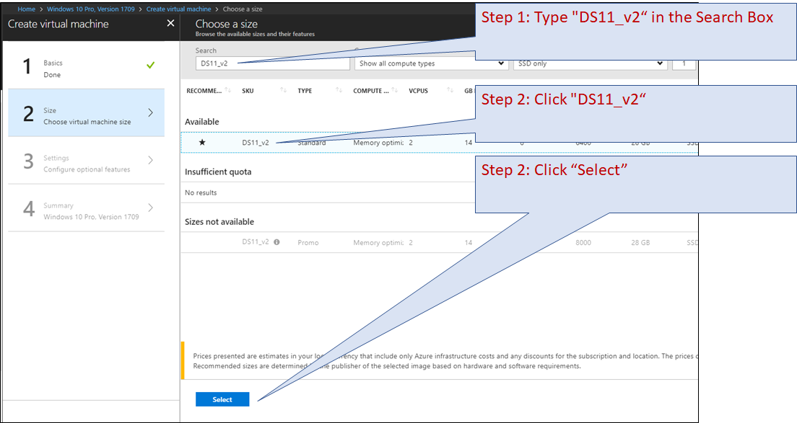

## 6. Set Auto Shutdown Schedule for VM    
This is to prevent unnecessary expenses.
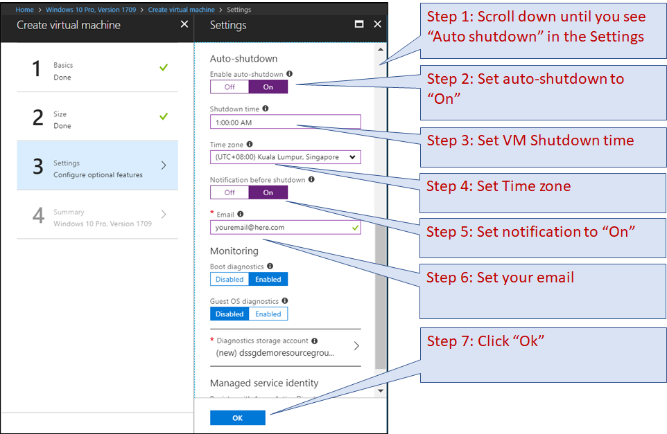

## 7. Click Create
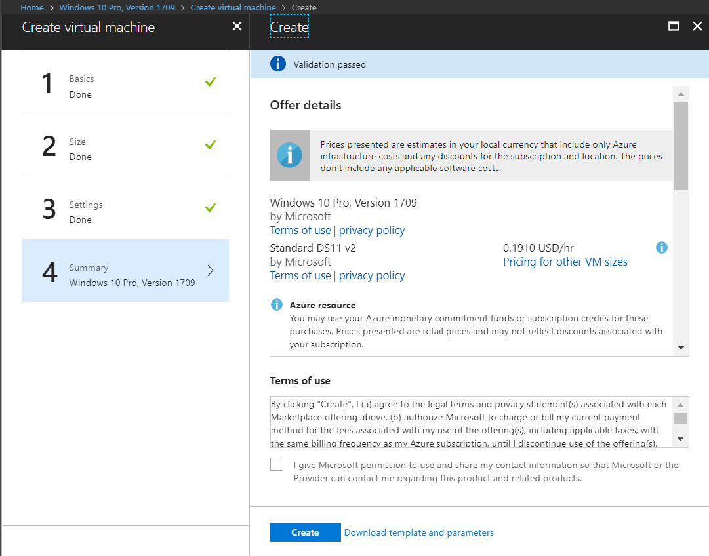

## 8. Monitor VM Deployment   
Go back to the Azure Portal Search Box
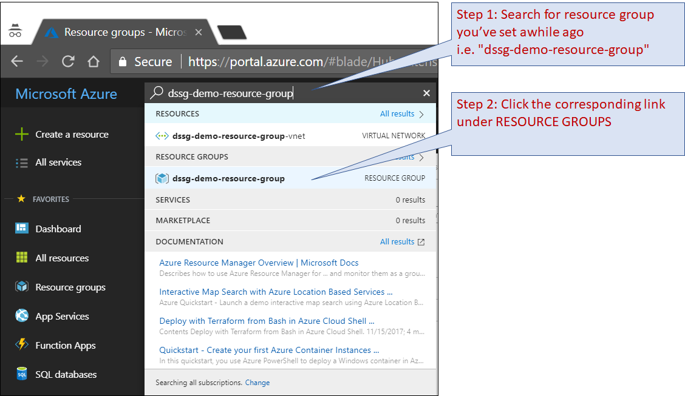

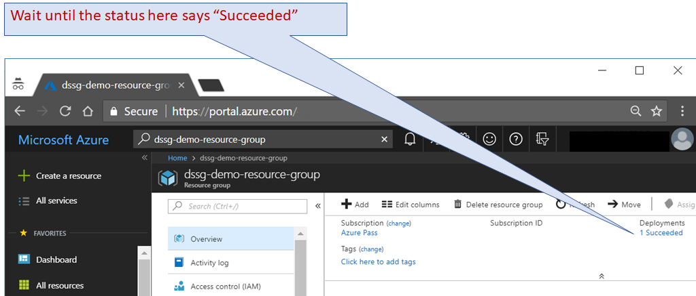
## 9. Ensure that the VM is running
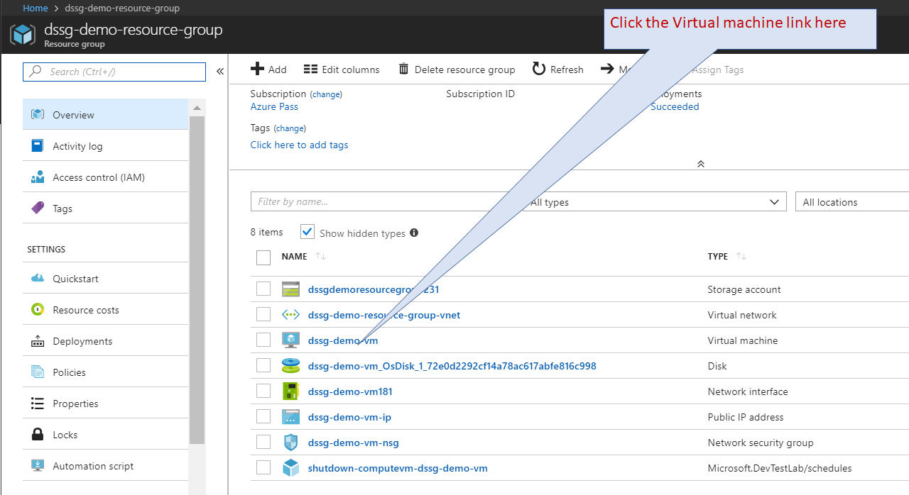
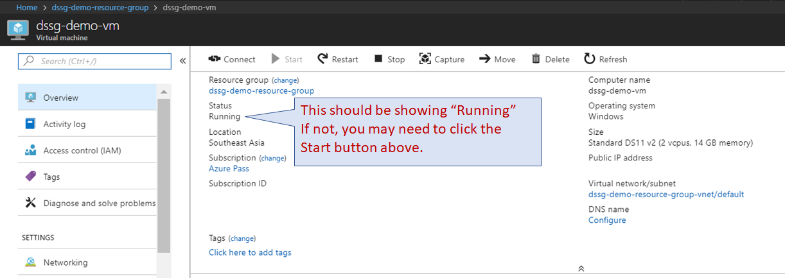

## 10. Connect to the VM via Remote Desktop
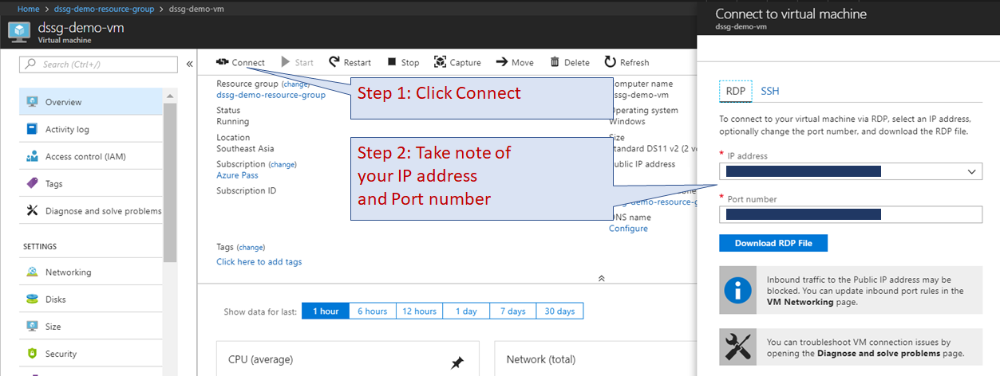

From Windows 10, Launch "Remote Desktop Connection".    
Supply the IP address and Port number.
Then, click Connect.
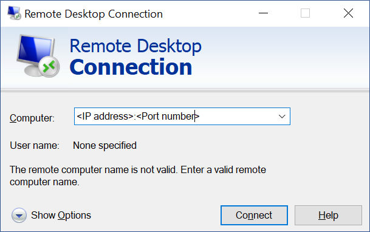

Supply the VM credentials you created awhile ago.
Then, click OK.
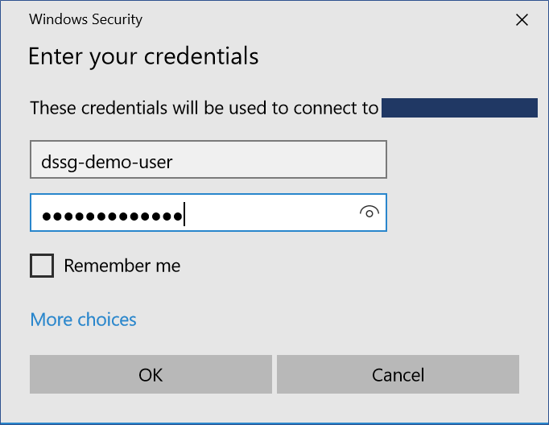
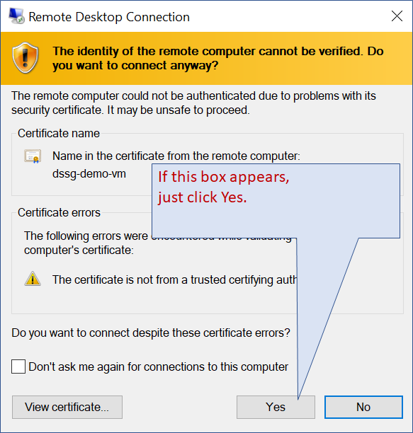

References:     
Using Remote Desktop on Windows 7:
https://www.youtube.com/watch?v=RJxgWPV0vi0    
Using Remote Desktop on a Mac:    
https://www.youtube.com/watch?v=nmzXb63kw9Y
 
If you're connected successfully, the Windows Desktop will appear. You can then proceed to use it like a normal Windows machine.    
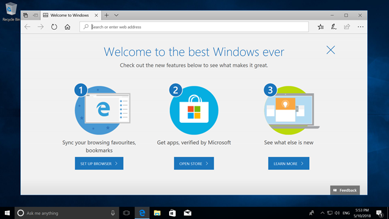

Note: If you have issue logging in with the VM credentials, it might be because of the password. Try changing your password and logging in again.

## Starting and Stopping the VM    
In the Azure Portal Search Box, search for your VM.
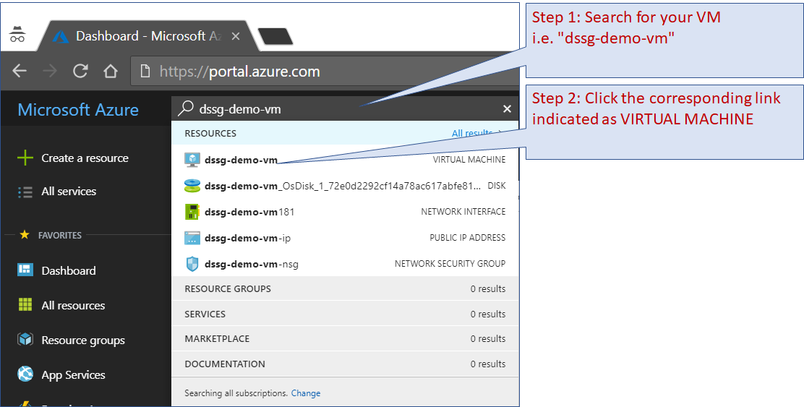    
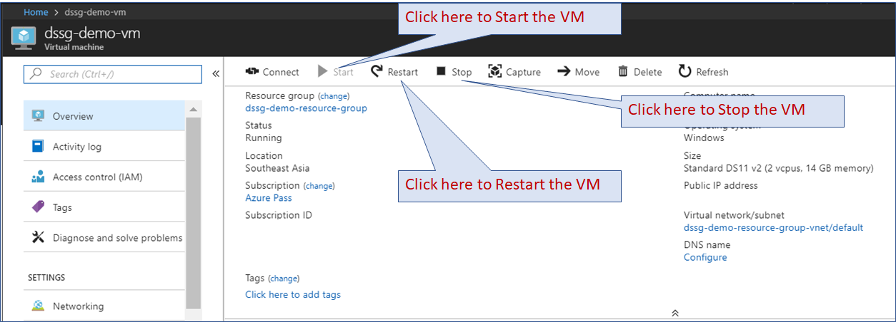
