# Workshop: Use Azure Machine Learning Workbench for Data Preparation (Bike share data)    

Note: This is a simplified version. You can find the full one [here](https://docs.microsoft.com/en-us/azure/machine-learning/desktop-workbench/workshop-bikeshare-dataprep).


Azure Machine Learning (preview) is an integrated, end-to-end data science and advanced analytics solution for professional data scientists to prepare data, develop experiments, and deploy models at cloud scale.

In this workshop, you'll use Azure Machine Learning Workbench (preview) to learn how to:
> [!div class="checklist"]
> * Prepare data interactively with the Machine Learning data preparation tool.
> * Import, transform, and create a test dataset.
> * Generate a data preparation package.
> * Run the data preparation package by using Python.
> * Generate a training dataset by reusing the data preparation package for additional input files.

## Data acquisition
This workshop uses the [Boston hubway dataset](https://s3.amazonaws.com/hubway-data/index.html) and Boston weather data from [NOAA](http://www.noaa.gov/).

1. Download the data files from the following links to your local development environment:

   * [Boston weather data](https://azuremluxcdnprod001.blob.core.windows.net/docs/azureml/bikeshare/BostonWeather.csv)

   * Hubway trip data from the hubway website:

      - [201501-hubway-tripdata.zip](https://s3.amazonaws.com/hubway-data/201501-hubway-tripdata.zip)
      - [201504-hubway-tripdata.zip](https://s3.amazonaws.com/hubway-data/201504-hubway-tripdata.zip)
      - [201510-hubway-tripdata.zip](https://s3.amazonaws.com/hubway-data/201510-hubway-tripdata.zip)
      - [201601-hubway-tripdata.zip](https://s3.amazonaws.com/hubway-data/201601-hubway-tripdata.zip)
      - [201604-hubway-tripdata.zip](https://s3.amazonaws.com/hubway-data/201604-hubway-tripdata.zip)
      - [201610-hubway-tripdata.zip](https://s3.amazonaws.com/hubway-data/201610-hubway-tripdata.zip)
      - [201701-hubway-tripdata.zip](https://s3.amazonaws.com/hubway-data/201701-hubway-tripdata.zip)

2. Unzip each .zip file after download.

## Learn about the datasets
1. The __Boston weather__ file contains the following weather-related fields, reported on an hourly basis:

   * **DATE**

   * **REPORTTPYE**

   * **HOURLYDRYBULBTEMPF**

   * **HOURLYRelativeHumidity**

   * **HOURLYWindSpeed**

2. The __hubway__ data is organized into files by year and month. For example, the file named `201501-hubway-tripdata.zip` contains a .csv file that contains data for January 2015. The data contains the following fields, with each row representing a bike trip:

   * **Trip Duration (in seconds)**

   * **Start Time and Date**

   * **Stop Time and Date**

   * **Start Station Name & ID**

   * **End Station Name & ID**

   * **Bike ID**

   * **User Type (Casual = 24-Hour or 72-Hour Pass user; Member = Annual or Monthly Member)**

   * **ZIP Code (if user is a member)**

   * **Gender (self-reported by member)**

## Create a new project
1. Start **Machine Learning Workbench** from your Start menu or launcher.

2. Create a new Machine Learning project. Select the **+** button on the **Projects** page, or select **File** > **New**.

   * Use the **Bike Share** template.

   * Name your project **BikeShare**. 

## <a id="newdatasource"></a>Create a new data source

1. Create a new data source. Select the **Data** button (cylinder icon) on the left toolbar to display the **Data** view.

   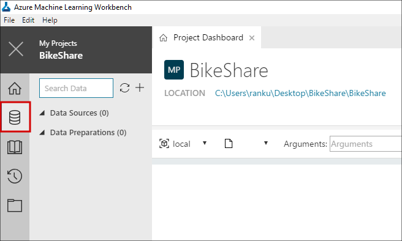

2. Add a data source. Select the **+** icon, and then select **Add Data Source**.

   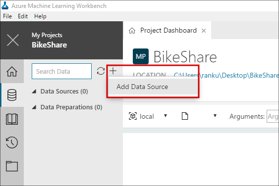

## Add weather data

1. **Data Store**: Select the data store that contains the data. Because you're using files, select **File(s)/Directory**. Select **Next** to continue.

   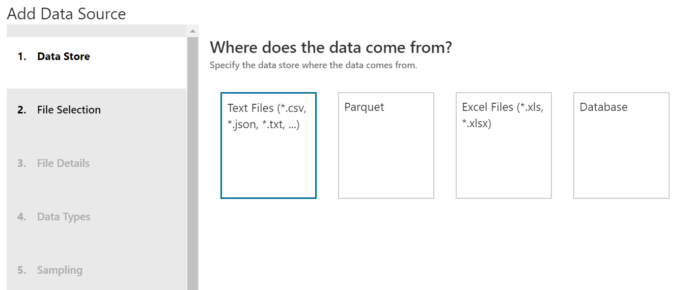

2. **File Selection**: Add the weather data. Browse and select the `BostonWeather.csv` file that you downloaded earlier. Select **Next**.

   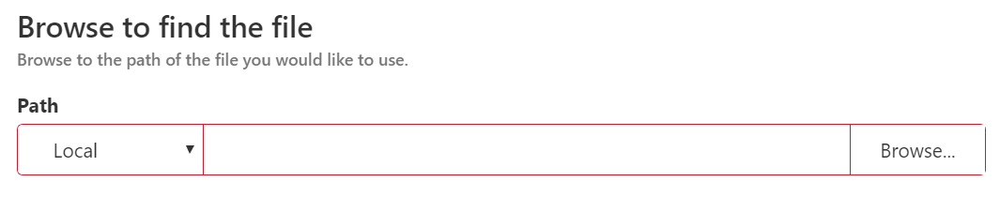


3. **File Details**: Verify the file schema that is detected. Machine Learning Workbench analyzes the data in the file and infers the schema to use.

   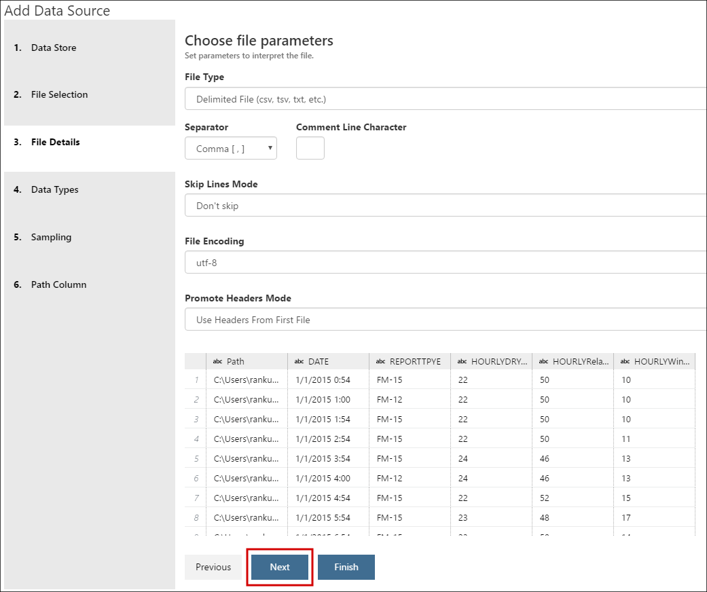

   > [!IMPORTANT]
   > Workbench might not detect the correct schema in some cases. Always verify that the parameters are correct for your data set. For the weather data, verify that they are set to the following values:
   >
   > * __File Type__: Delimited File (csv, tsv, txt, etc.)
   > * __Separator__: Comma [,]
   > * __Comment Line Character__: No value is set.
   > * __Skip Lines Mode__: Don't skip
   > * __File Encoding__: utf-8
   > * __Promote Headers Mode__: Use Headers From First File

   The preview of the data should display the following columns:

   * **Path**

   * **DATE**

   * **REPORTTYPE**

   * **HOURLYDRYBULBTEMPF**
   
   * **HOURLYRelativeHumidity**

   * **HOURLYWindSpeed**

   To continue, select **Next**.

4. **Data Types**: Review the data types that are detected automatically. Machine Learning Workbench analyzes the data in the file and infers the data types to use.

   a. For this data, change **DATA TYPE** for all the columns to **String**.

   > [!NOTE]
   > String is used to highlight the capabilities of Workbench later in this workshop. 

   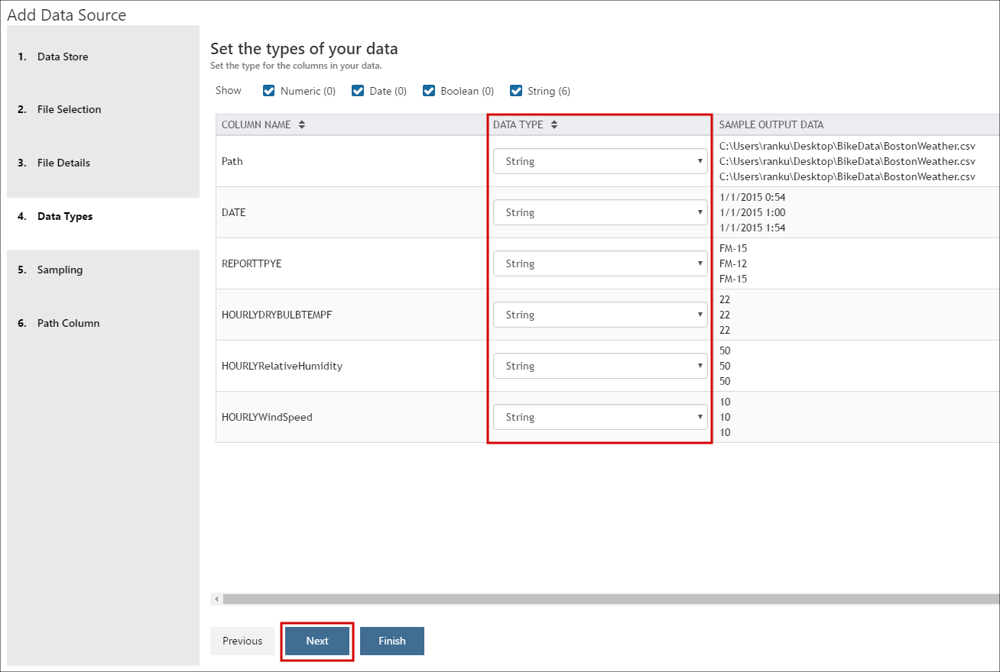

   b. To continue, select __Next__. 

5. **Sampling**: To create a sampling scheme, select **Edit**. Select the new __Top 10000__ row that is added, and then select __Edit__. Set __Sample Strategy__ to **Full File**, and then select **Apply**.

   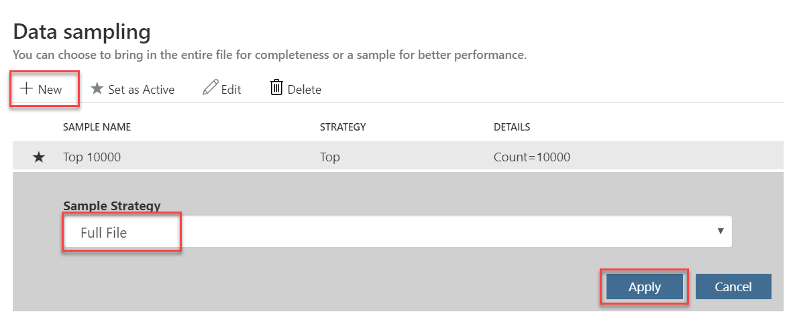

   To use the __Full File__ strategy, select the __Full File__ entry, and then select __Set as Active__. A star appears next to __Full File__ to indicate that it's the active strategy.

   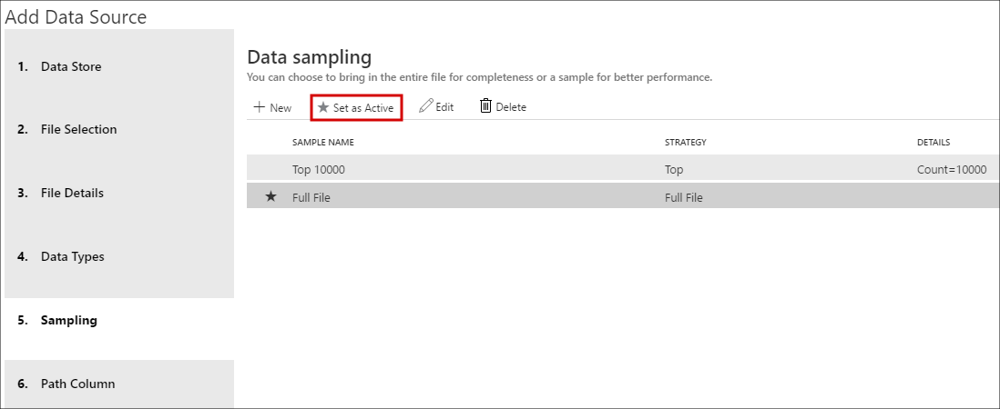

   To continue, select **Next**.

6. **Path Column**: Use the __Path Column__ section to include the full file path as a column in the imported data. Select __Do Not Include Path Column__.

   > [!TIP]
   > Including the path as a column is useful if you're importing a folder of many files with different file names. It's also useful if the file names contain information that you want to extract later.

   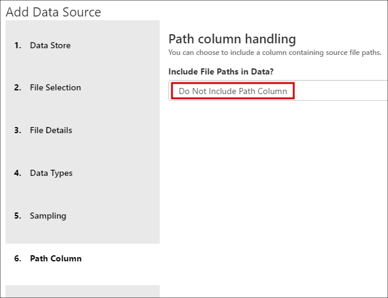

7. **Finish**: To finish creating the data source, select **Finish**.

    A new data source tab named __BostonWeather__ opens. A sample of the data is displayed in a grid view. The sample is based on the active sampling scheme specified previously.

    Notice that the **Steps** pane on the right side of the screen displays the individual actions taken while creating this data source.

   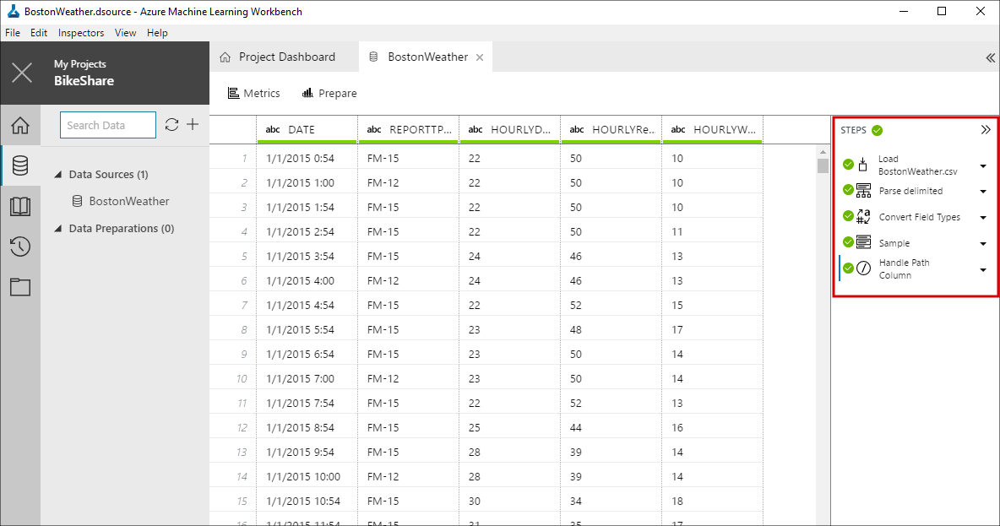

### View data source metrics

Select __Metrics__ at the upper left of the tab's grid view. This view displays the distribution and other aggregated statistics of the sampled data.

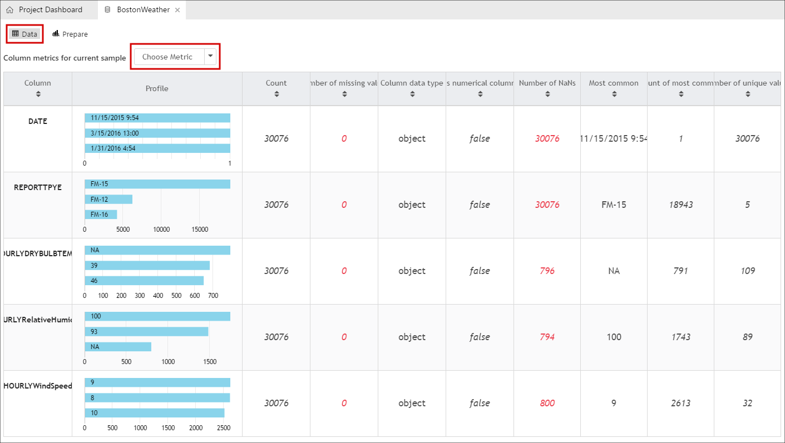

> [!NOTE]
> To configure the visibility of the statistics, use the **Choose Metric** drop-down list. Select and clear metrics there to change the grid view.

To return to the __Data__ view, select __Data__ in the upper left of the page.

## Add a data source to the data preparation package

1. Select __Prepare__ to begin preparing the data. 

2. When prompted, enter a name for the data preparation package, such as **BikeShare Data Prep**. 

3. Select __OK__ to continue.

   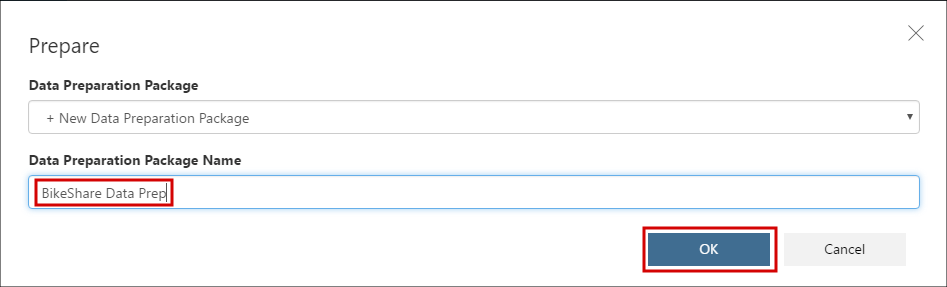

4. A new package named **BikeShare Data Prep** appears under the __Data Preparation__ section of the __Data__ tab. 

   To display the package, select this entry. 

5. Select the **>>** button to expand __Dataflows__ and display the dataflows contained in the package. In this example, __BostonWeather__ is the only dataflow.

   > [!IMPORTANT]
   > A package can contain multiple dataflows.

   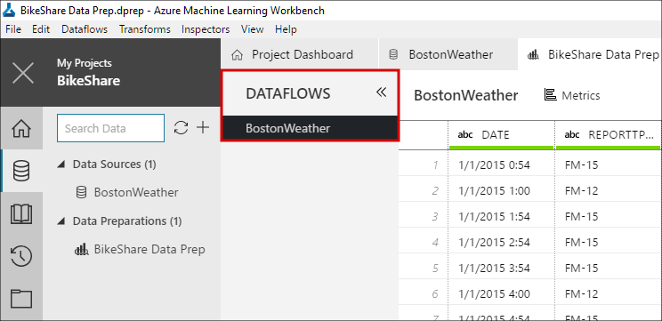

## Filter data by value
1. To filter data, right-click a cell with a certain value, and select __Filter__. Then select the type of filter.

2. For this workshop, select a cell that contains the value `FM-15`. Then set the filter to **equals**.  Now the data is filtered to only return rows where the __REPORTTYPE__ is `FM-15`.

   

   > [!NOTE]
   > FM-15 is a type of Meteorological Terminal Aviation Routine (METAR) weather report. The FM-15 reports are empirically observed to be the most complete, with little missing data.

## Remove a column

You no longer need the __REPORTTYPE__ column. Right-click the column header, and select **Remove Column**.

   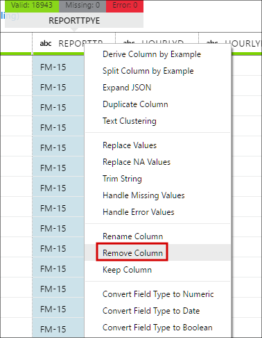

## Change datatypes and remove errors
1. Select Ctrl (Command ⌘ on Mac) while you select column headers to select multiple columns at the same time. Use this technique to select the following column headers:

   * **HOURLYDRYBULBTEMPF**

   * **HOURLYRelativeHumidity**

   * **HOURLYWindSpeed**

2. Right-click one of the selected column headers, and select **Convert Field Type to Numeric**. This option converts the data type for the columns to numeric.

   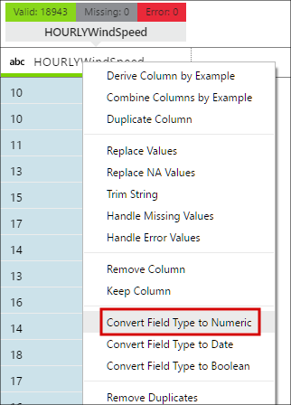

3. Filter out the error values. Some columns have data type conversion problems. This problem is indicated by the red color in the __Data Quality Bar__ for the column.

   To remove the rows that have errors, right-click the **HOURLYDRYBULBTEMPF** column heading. Select **Filter Column**. Use the default **I Want To** as **Keep Rows**. Change the **Conditions** drop-down list to select **is not error**. Select **OK** to apply the filter.

   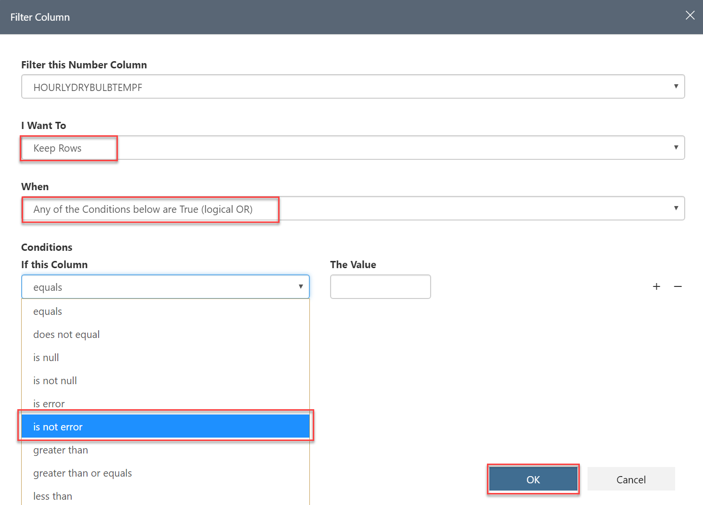

4. To eliminate the remaining error rows in the other columns, repeat this filter process for the **HOURLYRelativeHumidity** and **HOURLYWindSpeed** columns.

## Use by example transformations

To use the data in a prediction for two-hour time blocks, you must compute the average weather conditions for two-hour periods. Use the following actions:

* Split the **DATE** column into separate **Date** and **Time** columns. See the following section for the detailed steps.

* Derive an **Hour_Range** column from the **Time** column. See the following section for the detailed steps.

* Derive a **Date\_Hour\_Range** column from the **DATE** and **Hour_Range** columns. See the following section for the detailed steps.

### Split column by example

1. Split the **DATE** column into separate **Date** and **Time** columns. Right-click the **DATE** column header, and select **Split Column by Example**.

   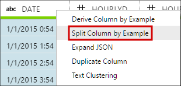

2. Machine Learning Workbench automatically identifies a meaningful delimiter and creates two columns by splitting the data into date and time values. 

3. Select __OK__ to accept the split operation results.

   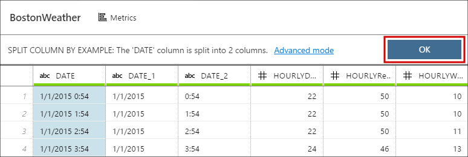

### Derive column by example

1. To derive a two-hour range, right-click the __DATE\_2__ column header, and select **Derive Column by Example**.

   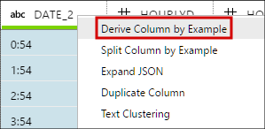

   A new empty column is added with null values.

2. Select in the first empty cell in the new column. To provide an example of the time range desired, type **12AM-2AM** in the new column, and then select Enter.

   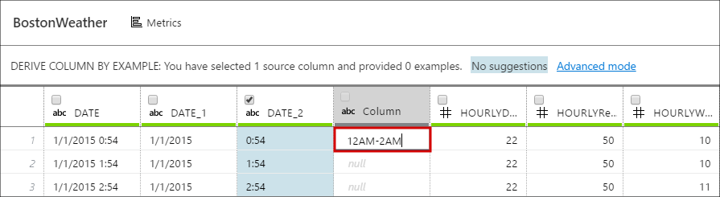

   > [!NOTE]
   > Machine Learning Workbench synthesizes a program based on the examples provided by you and applies the same program on remaining rows. All other rows are automatically populated based on the example you provided. Workbench also analyzes your data and tries to identify edge cases. 

   > [!IMPORTANT]
   > Identification of edge cases might not work on Mac in the current version of Workbench. Skip the following step 3 and step 4 on Mac. Instead, select __OK__ after all the rows are populated with the derived values.
   
3. The text **Analyzing Data** above the grid indicates that Workbench is trying to detect edge cases. When finished, the status changes to **Review next suggested row** or **No suggestions**. In this example, **Review next suggested row** is returned.

4. To review the suggested changes, select **Review next suggested row**. The cell that you should review and correct, if needed, is highlighted on the display.

   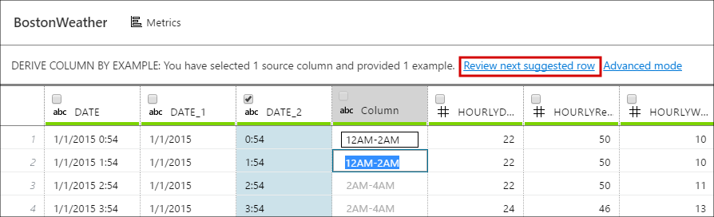

    Select __OK__ to accept the transformation.
 
5. You are returned to the grid view of data for __BostonWeather__. The grid now contains the three columns added previously.

   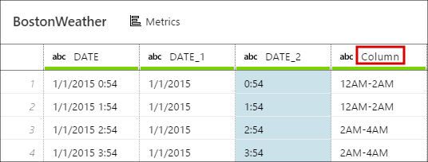

   > [!TIP]
   > All the changes you made are preserved in the **Steps** pane. Go to the step that you created in the **Steps** pane, select the down arrow, and select **Edit**. The advanced window for **Derive Column by Example** is displayed. All your examples are preserved here. You also can add examples manually by double-clicking on a row in the following grid. Select **Cancel** to return to the main grid without applying changes. You also can access this view by selecting **Advanced mode** while you perform a **Derive Column by Example** transform.

6. To rename the column, double-click the column header, and type **Hour Range**. Select Enter to save the change.

   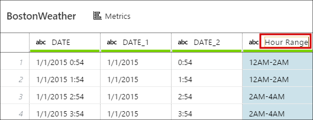

7. To derive the date and hour range, multi-select the **Date\_1** and **Hour Range** columns, right-click, and then select **Derive Column by Example**.

   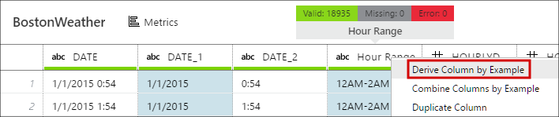

   Type **Jan 01, 2015 12AM-2AM** as the example against the first row, and select Enter.

   Workbench determines the transformation based on the example you provide. In this example, the result is that the date format is changed and concatenated with the two-hour window.

   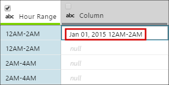

   > [!IMPORTANT]
   > On a Mac, take the following step instead of step 8:
   >
   > * Go to the first cell that contains **Feb 01, 2015 12AM-2AM**. It should be row 15. Correct the value to **Jan 02, 2015 12AM-2AM**, and select Enter. 
   

8. Wait for the status to change from **Analyzing Data** to **Review next suggested row**. This change might take several seconds. Select the status link to go to the suggested row. 

   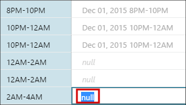

   The row has a null value because the source date value can be for either dd/mm/yyyy or mm/dd/yyyy. Type the correct value of **Jan 13, 2015 2AM-4AM**, and select Enter. Workbench uses the two examples to improve the derivation for the remaining rows.

   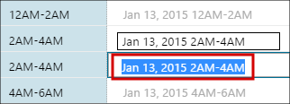

9. Select **OK** to accept the transform.

   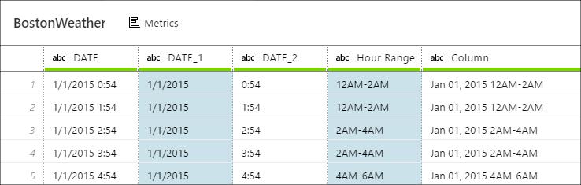

   > [!TIP]
   > To use the **Advanced mode** of **Derive Column by Example** for this step. select the down arrow in the **Steps** pane. In the data grid, there are check boxes next to the **DATE\_1** and **Hour Range** columns. Clear the check box next to the **Hour Range** column to see how the output changes. In the absence of the **Hour Range** column as input, **12AM-2AM** is treated as a constant and is appended to the derived values. Select **Cancel** to return to the main grid without applying your changes.
   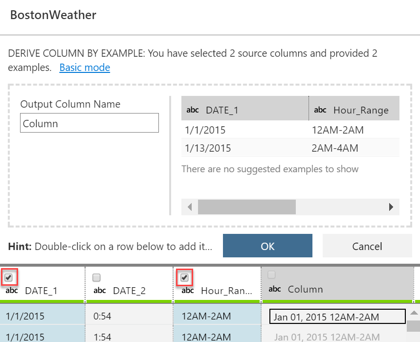

10. To rename the column, double-click the header. Change the name to **Date Hour Range**, and then select Enter.

11. Multi-select the **DATE**, **DATE\_1**, **DATE\_2**, and **Hour Range** columns. Right-click, and then select **Remove column**.

## Summarize data (mean)

The next step is to summarize the weather conditions by taking the mean of the values, grouped by hour range.

1. Select the **Date Hour Range** column, and then on the **Transforms** menu, select **Summarize**.

    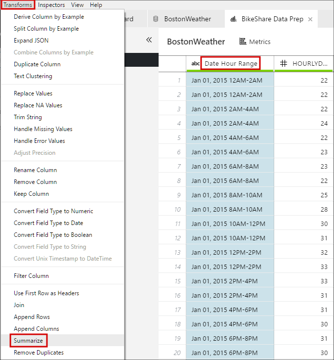

2. To summarize the data, drag columns from the grid at the bottom of the page to the left and right panes at the top. The left pane contains the text **Drag columns here to group data**. The right pane contains the text **Drag columns here to summarize data**. 

    a. Drag the **Date Hour Range** column from the grid at the bottom to the left pane. Drag **HOURLYDRYBULBTEMPF**, **HOURLYRelativeHumidity**, and **HOURLYWindSpeed** to the right pane. 

    b. In the right pane, select **Mean** as the **Aggregate** measure for each column. Select **OK** to finish the summarization.

    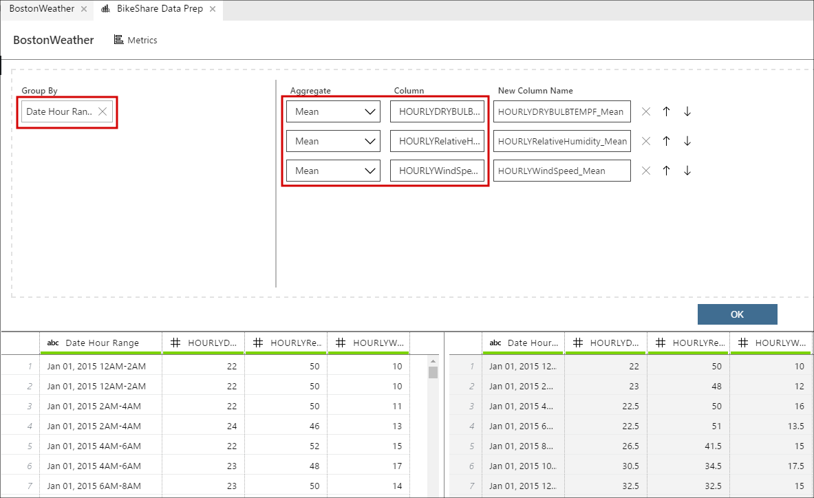

## Transform dataflow by using script

Changing the data in the numeric columns to a range of 0 to 1 allows some models to converge quickly. Currently, there is no built-in transformation to generically do this transformation. Use a Python script to perform this operation.

1. On the **Transform** menu, select **Transform Dataflow (Script)**.

2. Enter the following code in the text box that appears. If you used the column names, the code should work without modification. You are writing a simple min-max normalization logic in Python.

    > [!WARNING]
    > The script expects the column names used previously in this workshop. If you have different column names, you must change the names in the script.

   ```python
   maxVal = max(df["HOURLYDRYBULBTEMPF_Mean"])
   minVal = min(df["HOURLYDRYBULBTEMPF_Mean"])
   df["HOURLYDRYBULBTEMPF_Mean"] = (df["HOURLYDRYBULBTEMPF_Mean"]-minVal)/(maxVal-minVal)
   df.rename(columns={"HOURLYDRYBULBTEMPF_Mean":"N_DryBulbTemp"},inplace=True)

   maxVal = max(df["HOURLYRelativeHumidity_Mean"])
   minVal = min(df["HOURLYRelativeHumidity_Mean"])
   df["HOURLYRelativeHumidity_Mean"] = (df["HOURLYRelativeHumidity_Mean"]-minVal)/(maxVal-minVal)
   df.rename(columns={"HOURLYRelativeHumidity_Mean":"N_RelativeHumidity"},inplace=True)

   maxVal = max(df["HOURLYWindSpeed_Mean"])
   minVal = min(df["HOURLYWindSpeed_Mean"])
   df["HOURLYWindSpeed_Mean"] = (df["HOURLYWindSpeed_Mean"]-minVal)/(maxVal-minVal)
   df.rename(columns={"HOURLYWindSpeed_Mean":"N_WindSpeed"},inplace=True)

   df
   ```

    > [!TIP]
    > The Python script must return `df` at the end. This value is used to populate the grid.
    
   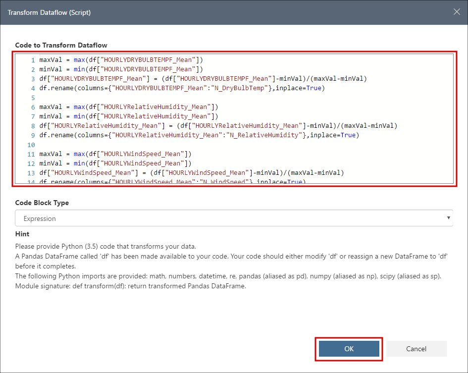

3. Select __OK__ to use the script. The numeric columns in the grid now contain values in the range of 0 to 1.

    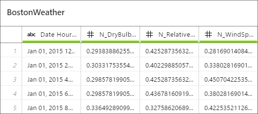

You have finished preparing the weather data. Next, prepare the trip data.

## Load trip data

1. To import the `201701-hubway-tripdata.csv` file, use the steps in the [Create a new data source](#newdatasource) section. Use the following options during the import process:

    * __File Selection__: Select **Local** when you browse to select the file.

    * __Sampling Scheme__: Select **Full File** sampling scheme, and make the sample active.

    * __Data Type__: Accept the defaults.

2. After you import the data, select __Prepare__ to begin preparing the data. Select the existing **BikeShare Data Prep.dprep** package, and then select __OK__.

    This process adds a **Dataflow** to the existing **Data Preparation** file rather than creating a new one.

    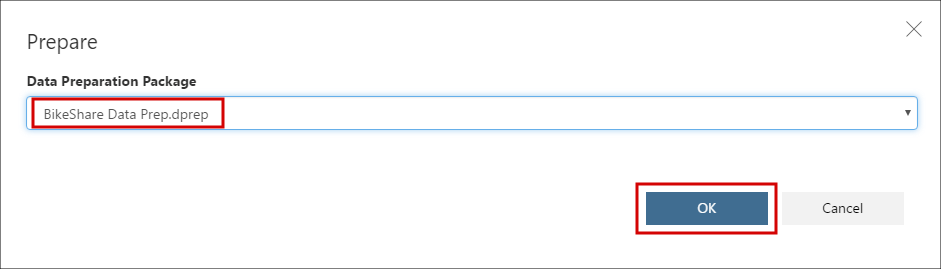

3. After the grid has loaded, expand __DATAFLOWS__. There are now two dataflows: **BostonWeather** and **201701-hubway-tripdata**. Select the **201701-hubway-tripdata** entry.

    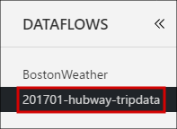

## Use the map inspector

For data preparation, useful visualizations called inspectors are available for string, numeric, and geographical data. They help you to understand the data better and identify outliers. Follow these steps to use the map inspector.

1. Multi-select the **start station latitude** and **start station longitude** columns. Right-click one of the columns, and then select **Map**.

    > [!TIP]
    > To enable multi-select, hold down the Ctrl key (Command ⌘ on Mac), and select the header for each column.

    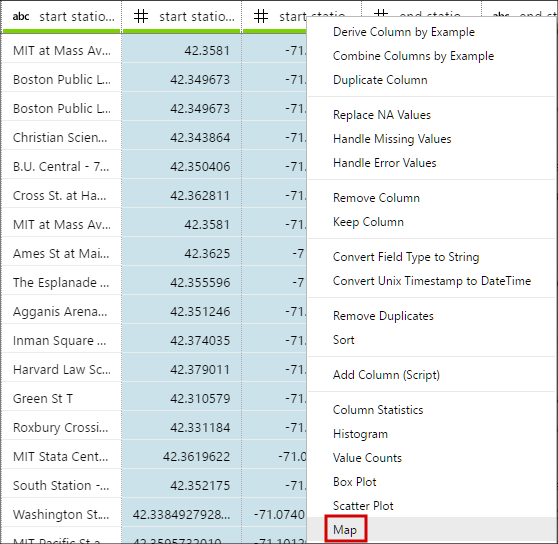

2. To maximize the map visualization, select the **Maximize** icon. To fit the map to the window, select the **E** icon on the upper-left side of the visualization.

    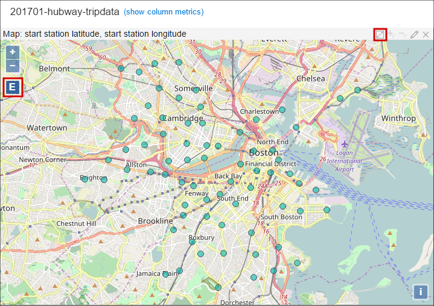

3. Select the **Minimize** button to return to the grid view.

## Use the column statistics inspector

To use the column statistics inspector, right-click the __tripduration__ column, and select __Column Statistics__.

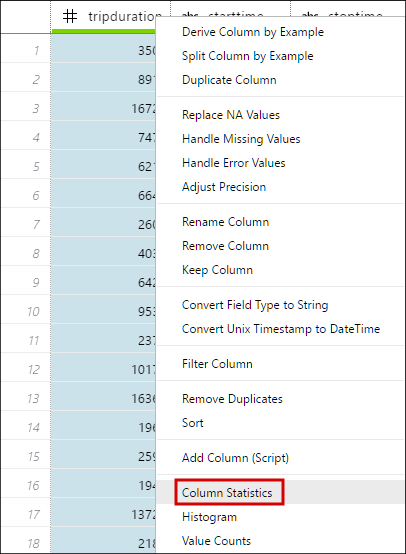

This process adds a new visualization titled __tripduration Statistics__ in the __INSPECTORS__ pane.

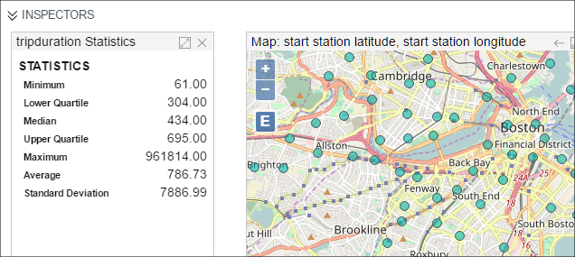

> [!IMPORTANT]
> The maximum value of the trip duration is 961,814 minutes, which is about two years. It seems there are some outliers in the dataset.

## Use the histogram inspector

To attempt to identify outliers, right-click the __tripduration__ column, and select __Histogram__.

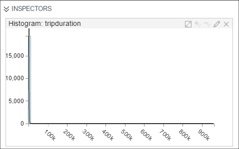

The histogram isn't helpful because the outliers skew the graph.

## Add a column by using script

1. Right-click the **tripduration** column, and select **Add Column (Script)**.

    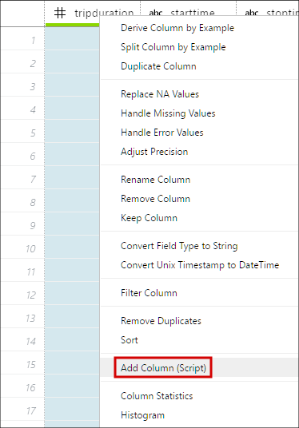

2. In the __Add Column (Script)__ dialog box, use the following values:

    * __New Column Name__: logtripduration

    * __Insert this New Column After__: tripduration

    * __New Column Code__: `math.log(row.tripduration)`

    * __Code Block Type__: Expression

   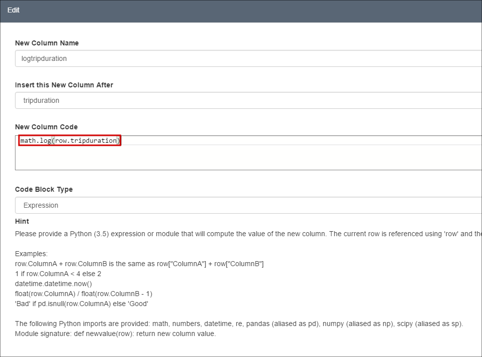

3. Select __OK__ to add the **logtripduration** column.

4. Right-click the column, and select **Histogram**.

    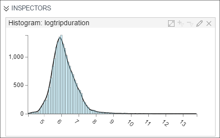

    Visually, this histogram seems like a normal distribution with an abnormal tail.

## Use an advanced filter

Using a filter on the data updates the inspectors with the new distribution. 

1. Right-click the **logtripduration** column, and select **Filter Column**. 

2. In the __Edit__ dialog box, use the following values:

    * __Filter this Number Column__: logtripduration

    * __I Want To__: Keep Rows

    * __When__: Any of the Conditions below are True (logical OR)

    * __If this Column__: less than

    * __The Value__: 9

    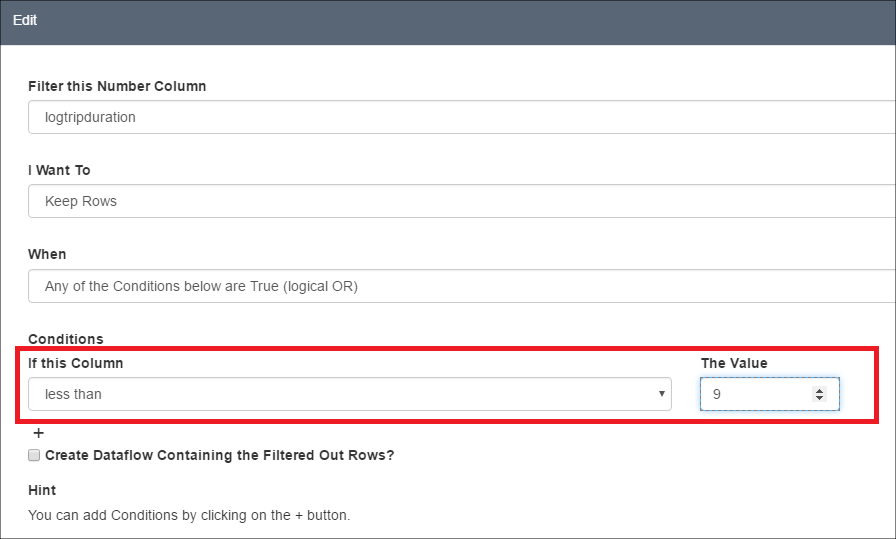

3. Select __OK__ to apply the filter.

    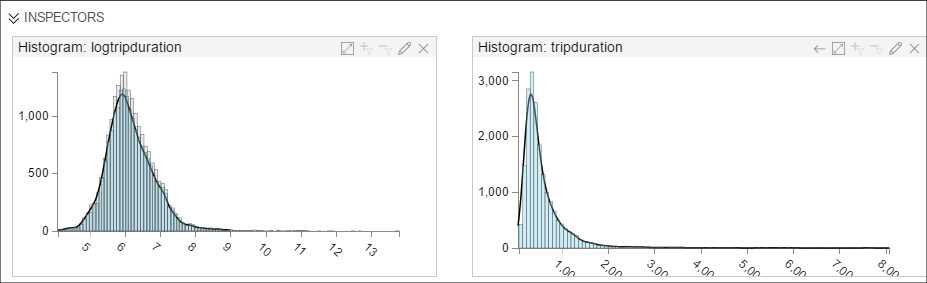

### The halo effect

1. Maximize the **logtripduration** histogram. A blue histogram is overlaid on a gray histogram. This display is called the **Halo Effect**:

    * The gray histogram represents the distribution before the operation (in this case, the filtering operation).

    * The blue histogram represents the histogram after the operation. 

   The halo effect helps with visualizing the effect of an operation on the data.

   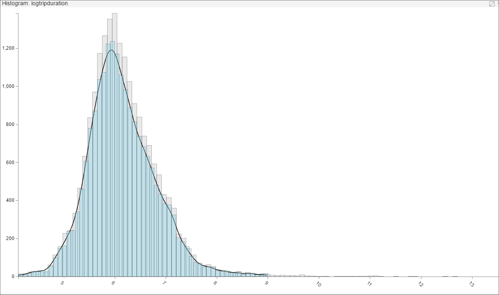

    > [!NOTE]
    > The blue histogram appears shorter compared to the previous one. This difference is due to automatic re-bucketing of data in the new range.

2. To remove the halo, select __Edit__ and clear __Show halo__.

    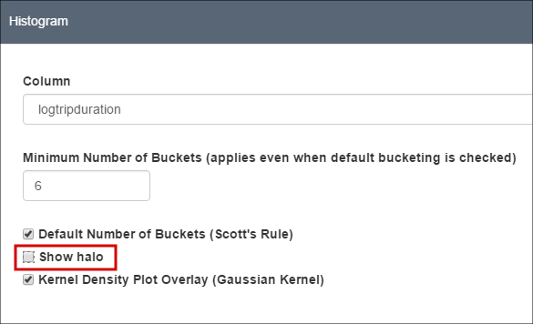

3. Select **OK** to disable the halo effect. Then minimize the histogram.

### Remove columns

In the trip data, each row represents a bike pickup event. For this workshop, you need only the **starttime** and **start station id** columns. To remove the other columns, multi-select these two columns, right-click the column header, and then select **Keep Column**. Other columns are removed.

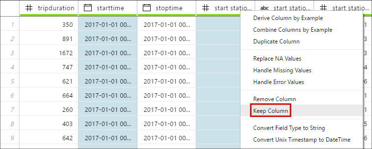

### Summarize data (count)

To summarize bike demand for a two-hour period, use derived columns.

1. Right-click the **starttime** column, and select **Derive Column by Example**.

    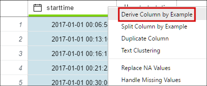

2. For the example, enter a value of **Jan 01, 2017 12AM-2AM** for the first row.

    > [!IMPORTANT]
    > In the previous example of deriving columns, you used multiple steps to derive a column that contained the date and time period. In this example, you can see that this operation can be performed as a single step by providing an example of the final output.

    > [!NOTE]
    > You can give an example against any of the rows. For this example, the value of **Jan 01, 2017 12AM-2AM** is valid for the first row of data.

    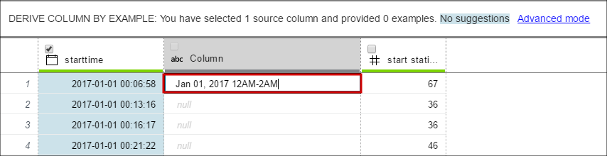

   > [!IMPORTANT]
   > On a Mac, follow this step instead of step 3:
   >
   > * Go to the first cell that contains **Jan 01, 2017 1AM-2AM**. It should be row 14. Correct the value to **Jan 01, 2017 12AM-2AM**, and select Enter. 

3. Wait until the application computes the values against all the rows. The process might take several seconds. After the analysis is finished, use the __Review next suggested row__ link to review data.

   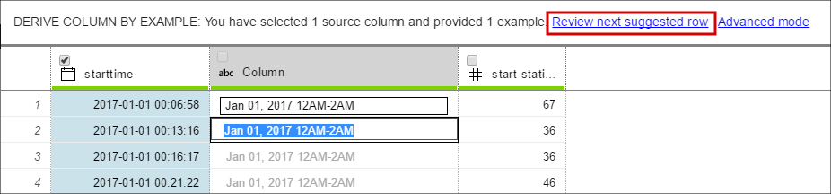

    Ensure that the computed values are correct. If not, update the value with the expected value, and select Enter. Then wait for the analysis to finish. Complete the **Review next suggested row** process until you see **No suggestions**. **No suggestions** means the application looked at the edge cases and is satisfied with the synthesized program. It's a best practice to perform a visual inspection of the transformed data before you accept the transformation. 

4. Select **OK** to accept the transform. Rename the newly created column to **Date Hour Range**.

    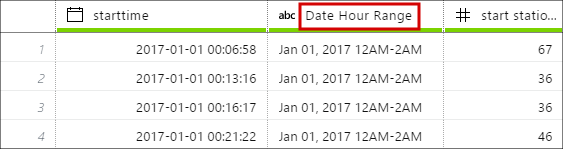

5. Right-click the **starttime** column header, and select **Remove column**.

6. To summarize the data, on the __Transform__ menu, select __Summarize__. To create the transformation, use the following steps:

    * Drag __Date Hour Range__ and __start station id__ to the **Group By** pane on the left.

    * Drag __start station id__ to the **summarize data** pane on the right.

   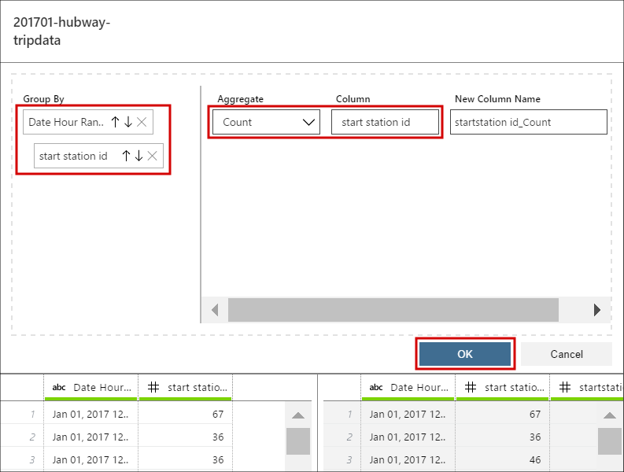

7. Select **OK** to accept the summary result.

## Join dataflows

To join the weather data with the trip data, use the following steps:

1. On the __Transforms__ menu, select __Join__.

2. __Tables__: Select **BostonWeather** as the **Left** dataflow and **201701-hubway-tripdata** as the **Right** dataflow. To continue, select **Next**.

    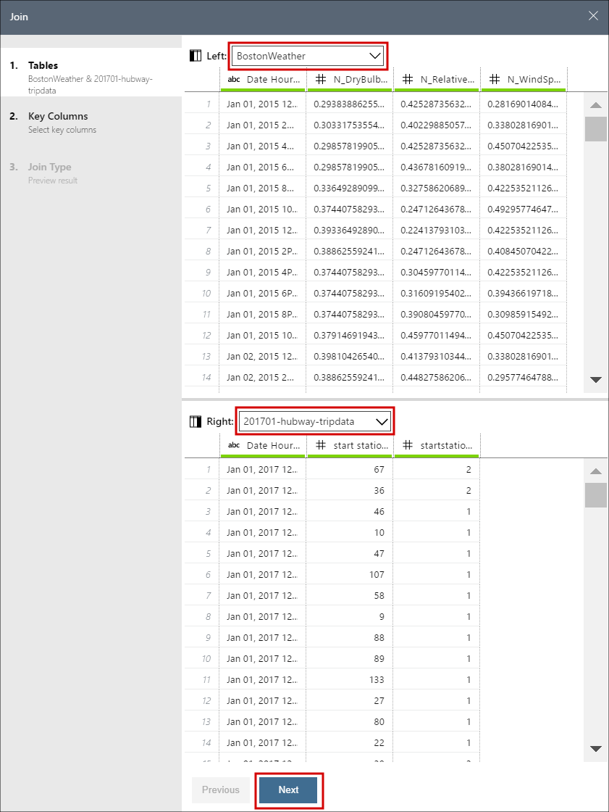

3. __Key Columns__: Select the **Date Hour Range** column in both the tables, and then select __Next__.

    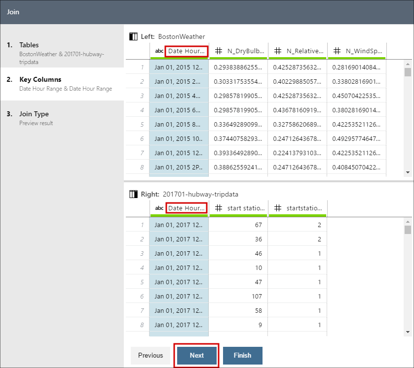

4. __Join Type__: Select __Matching rows__ as the join type, and then select __Finish__.

    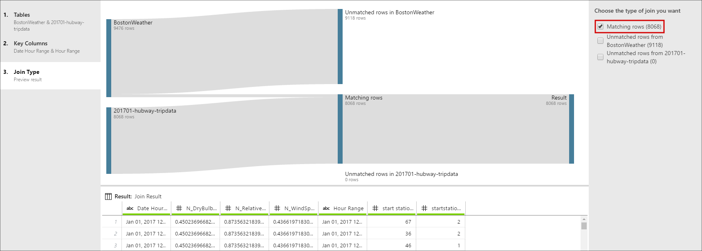

    This process creates a new dataflow named __Join Result__.

## Create additional features

1. To create a column that contains the day of the week, right-click the **Date Hour Range** column and select **Derive Column by Example**. Use a value of __Sun__ for a date that occurred on a Sunday. An example is **Jan 01, 2017 12AM-2AM**. Select Enter, and then select **OK**. Rename this column to __Weekday__.

    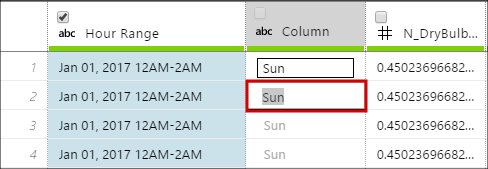

2. To create a column that contains the time period for a row, right-click the **Date Hour Range** column, and select **Derive Column by example**. Use a value of **12AM-2AM** for the row that contains **Jan 01, 2017 12AM-2AM**. Select Enter, and then select **OK**. Rename this column to **Period**.

    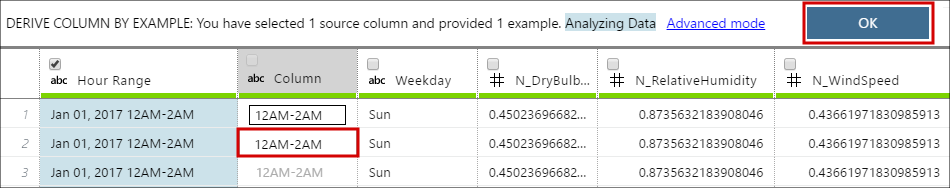

3. To remove the **Date Hour Range** and **r_Date Hour Range** columns, select Ctrl (Command ⌘ on Mac), and then select each column header. Right-click, and select **Remove Column**.

## Read data from Python

You can run a data preparation package from Python and retrieve the result as a **Data Frame**.

To generate an example Python script, right-click __BikeShare Data Prep__, and select __Generate Data Access Code File__. The example Python file is created in your **Project Folder** and is also loaded in a tab within Workbench. The following Python script is an example of the code that is generated:

```python
# Use the Azure Machine Learning data preparation package
from azureml.dataprep import package

# Use the Azure Machine Learning data collector to log various metrics
from azureml.logging import get_azureml_logger
logger = get_azureml_logger()

# This call will load the referenced package and return a DataFrame.
# If run in a PySpark environment, this call returns a
# Spark DataFrame. If not, it will return a Pandas DataFrame.
df = package.run('BikeShare Data Prep.dprep', dataflow_idx=0)

# Remove this line and add code that uses the DataFrame
df.head(10)
```


## Summary
You have finished the bike-share data preparation workshop. In this workshop, you used Machine Learning Workbench (preview) to learn how to:
> [!div class="checklist"]
> * Prepare data interactively with the Machine Learning data preparation tool.
> * Import, transform, and create a test dataset.
> * Generate a data preparation package.
> * Run the data preparation package by using Python.


